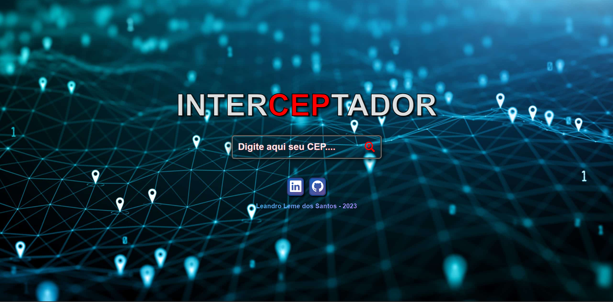

# INTERCEPTADOR - Buscador de CEP

Deploy do projeto: <https://interceptador-busca-cep.vercel.app/>

## Sobre

É um site que tem como funcionabilidade localizar o endereço através do CEP.

### Objetivo

É ter o primeiro contato com o React, pois meu objetivo é ampliar meus conhecimentos de front-end. Usei como base alguns vídeos sobre o assunto para que pudesse executar este projeto, uma vez que nunca tinha utilizado esta biblioteca, pois acho muito importante praticá-lo.

### Desafio

Compreender como funciona o React e realizar um projeto o qual me tire da zona de conforto e aprendendo algo novo.

### Conclusão

Foi uma experiência interessante, percebi que as possibilidades na utilização do React são muito maiores que só utilizar as linguagens isoladas. Irei me aprofundar nesta biblioteca para poder aplicar nos próximos projetos. Tive alguns problemas com deploy do projeto e tive que criar outro repositório (que é este aqui) para publicar o código que já estava pronto em outro repositório do meu perfil. Então tive que privar o outro repositório para não perder os dias de commit do perfil.

### Ferramentas Utilizadas

- React
- HTML
- CSS
- JavaScript